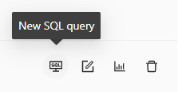
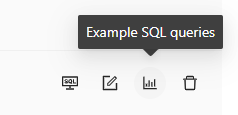
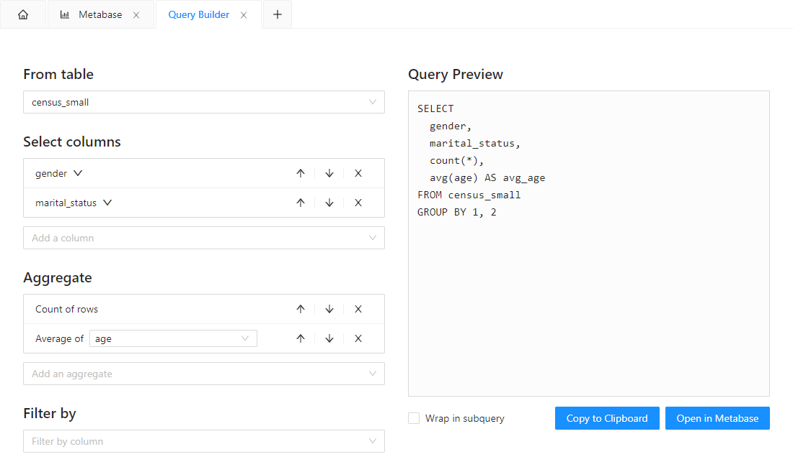
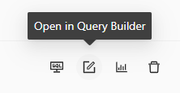

# Operation

> To report feature requests or problems, please contact us at [feedback@open-diffix.org](mailto:feedback@open-diffix.org).

**Diffix Dashboards'** purpose is to allow anonymized analysis of data using Metabase, an easy to use Business Intelligence (BI) tool.

With **Diffix Dashboards** you will be able to pick one or more CSV files containing personal data, and transform them into Metabase-driven
summaries and charts in a way which ensures GDPR-compliant anonymity. For details on the anonymization procedure itself see [Anonymization](anonymization.md).

## Running **Diffix Dashboards**

When you start **Diffix Dashboards**, it will start an internal local database (powered by [PostgreSQL](https://www.postgresql.org/)) and
a local [Metabase](https://www.metabase.com/) engine. Both services are required for **Diffix Dashboards** to function correctly.

Initial startup of PostgreSQL and Metabase might take a while, but is faster on subsequent starts of **Diffix Dashboards**.
Please ensure that **Diffix Dashboards** displays two green checkmarks on its main `Admin Panel` tab:

If you experience something different, please refer to the section [Troubleshooting](#troubleshooting) below for guidance.

## Data Import

In order to anonymize and explore your data in **Diffix Dashboards**, you need to import it first. The process to import a CSV file into
**Diffix Dashboards** is straightforward. Request a new import on the `Admin Panel` tab and follow instructions in the left-hand side bar.

If you have several files to import, you can work on them in parallel by opening multiple import tabs.

Whenever you import a table having a Metabase tab open, you will notice `Refresh` icons appear at the tab headers.
When you click on the icon, it will cause the respective Metabase tab to reload to acknowledge the new tables.
**NOTICE**: if you have any ongoing work in the tab it might be lost on refresh. In this case open a new Metabase tab to work with the new tables.

## Using Metabase

To start using Metabase and analyze the imported data, click on one of the buttons in the list of imported tables.

Clicking on `New SQL query` opens a new Metabase tab to write SQL queries with anonymized results.

`Example SQL queries` opens a Metabase tab with an automatically generated dashboard that contains example queries and charts.
You can use Metabase to modify and extend the examples. Loading examples might take a while for the first time they are opened.

If you are already familiar with Metabase, you will find it works just like regular Metabase you would open in a web
browser tab, except for a few notable differences:

**No login** - **Diffix Dashboards** arranges a Metabase session for you, so you don't have to register or log in.

**Local data** - all the data and dashboards are local and cannot be collaborated on remotely.

**Limitations of automatic data exploration tools** - **Diffix Dashboards** operates using **Diffix Fir** anonymization
(see [Anonymization](anonymization.md) for more details), and because of that it limits the SQL features available to
the user. When exploring data via the `Anonymized access` data source, you might stumble upon functions returning errors
because **Diffix Fir** treats them as non-privacy preserving and blocks them.

In case you stumble upon a SQL feature blocked by **Diffix Fir**, you should see an error message providing a hint as to
what is wrong. In the example below we have tried to `SELECT` the protected entity ID directly.

If you have difficulties writing SQL by hand, the [Query Builder](#query-builder) offers a friendly interface to assist you in creating queries.
If anything else is blocking you, please contact us at [feedback@open-diffix.org](mailto:feedback@open-diffix.org),
we will be happy to discuss your use case and help.

Use `Direct access` instead of `Anonymized access` data source to bypass anonymization completely. You have this option
if you use the `+ New` button within Metabase to start building a SQL query.

**CAUTION**: All the questions, SQL queries and dashboards using `Direct access` as data source will **not be
anonymous**.

## Query Builder

The Query Builder tab allows you to build SQL queries by visually selecting the desired columns and aggregates.

To start building a query, click on the `Open in Query Builder` button for the desired table in the list of imported tables.

**Selecting columns and aggregates**

Use the dropdowns on the left side to choose what data and aggregates the query includes.

- **From table**: Table to select data from. Initially set to the table that was clicked when opening the tab.
- **Select columns**: Which columns to group by in the result. Depending on the column type,
expanding the chevron near the column name opens generalization options.
- **Aggregate**: Which summary functions to run on result groups.
- **Filter by**: Sets pre-anonymization filters in the form of `column = value`.
  Only rows that match ***all*** filters will be processed further.

To the right of list items, there are up and down arrows to reorder them. The `X` button removes an item from the query.

**Query Preview**

The right side of the page shows the query preview and buttons to export the query.
Clicking on `Open in Metabase` will open a new Metabase tab with the query box pre-populated.
`Copy to Clipboard` copies the query text to the clipboard.

If `Wrap in subquery` is checked, the query will add a placeholder wrapper query. This allows you to post-process the anonymized results.
Because the upper query runs after sensitive data has been anonymized, there are no restrictions and any SQL feature may be used.

## Troubleshooting

If you find **Diffix Dashboards** doing something unexpected, you can export the logs collected by using the menu function `Actions -> Export Logs`.
Review them to ensure they do not contain any personal data and send them to [feedback@open-diffix.org](mailto:feedback@open-diffix.org).
